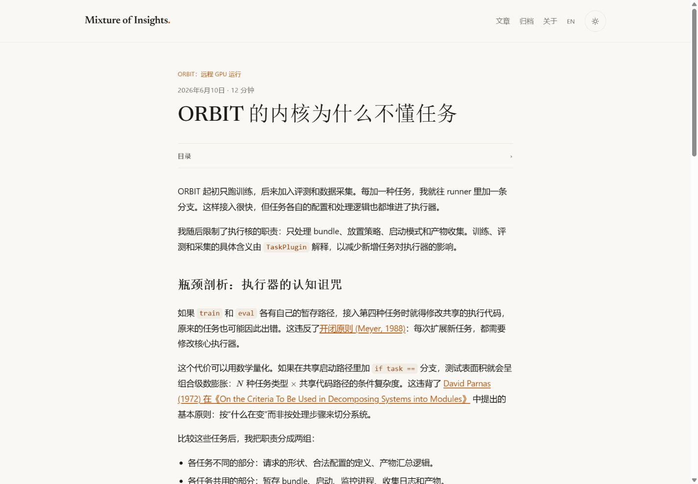
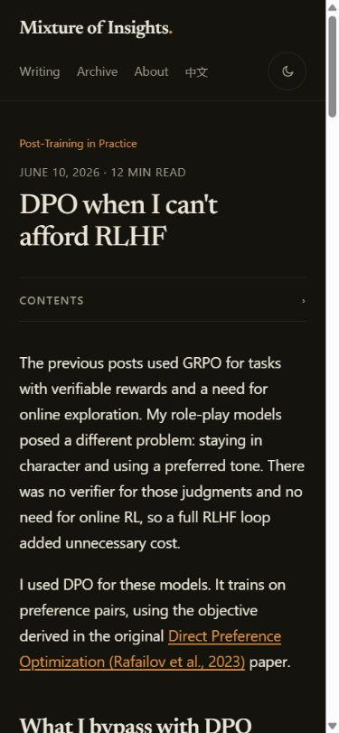

# 全站文章文字修订 · 2026-09-14

作者在页面改版后指定使用 HumanWriting，并明确将范围扩展到“网站全部文章”。本轮完整阅读了 18 篇文章的中英文版本，共 36 份 Markdown；36 份正文都有局部编辑，31 份摘要重新措辞。先前已改好的 4 份样本摘要以及中文 Wallet 摘要沿用。

这轮修改面向有技术背景、但不熟悉项目的读者。重点是让段落直接讲观察、实现和判断，减少重复铺垫、夸张比喻和没有新增信息的收尾。排障记录、机制解释、方案讨论分别保留原有叙述方式；没有要求所有文章使用同一套开场、第一人称或结论模板。

## 改动示例

以下节选均来自实际 diff，修订前版本为 `9773e85023e5a3501782cbae668b87c517910880`。

| 文章 | 修订前 | 修订后 |
| --- | --- | --- |
| ORBIT 的内核为什么不懂任务 | “起初它跑得飞快，但很快，执行器就成了一座收容所有业务怪癖的疯人院。” | “这样接入很快，但任务各自的配置和处理逻辑也都堆进了执行器。” |
| 同上 | “不变的这部分，就是执行器的物理极限。……我沿着这条物理缝隙，精准地切了一刀。” | “前一组负责整理请求和读取结果，交给插件；后一组保留在执行器中。” |
| 十五个 App 正在读整台设备的日志 | “解决方案分三层推进。首先是强行撤销。” | “我先写了一个 shell 循环，通过 `adb shell su` 执行 `pm revoke`，撤销所有已有授权。” |
| How Qwen3-TTS makes a frame of sound | “Fusing these disparate operations into a single computational graph is a mistake. I split the generation into three stages.” | “I split generation into three stages to separate their compute requirements.” |

没有删掉有用的具体经历。例如中文 DPO 的角色扮演问题、logcat 排查中的误判，以及 PayPal 调试中出现黑屏的过程都保留。它们原本就在文章中，并非为模拟“真人感”补写的故事。

## 逐篇范围

表中每一行均覆盖 en、zh 全文。这里列的是文字处理重点，不代表完成了技术真实性核验。

| Slug | 本轮编辑重点 |
| --- | --- |
| `01-the-google-wallet-wall` | 缩减“撞墙”等反复渲染；按完整性检测、观察结果和限制组织过渡。 |
| `02-stockmask` | 用包管理服务、调用方和过滤逻辑解释实现，减少“手术”“原厂感”等修辞。 |
| `03-the-logcat-leak` | 保留 15 个 App 的本次观察；顺着撤销授权、运行时请求和 SELinux 域验证讲过程。 |
| `04-auditing-from-the-apps-eyes` | 直接说明探针的 UID、命名空间和 SELinux 上下文，删掉对抗式铺垫。 |
| `05-what-you-can-and-cant-hide` | 压缩重复结尾，用检测面与现有结果衔接各段。 |
| `06-paypal-crash-two-root-signals` | 合并重复限定语；保留历史触发未知、静态推导与运行时捕获的区别、探针风险和未完成的验证。 |
| `a-control-plane-for-renting-gpus` | 围绕租用实例、任务状态和产物回收解释控制面，减少宣言式表述。 |
| `orbit-a-task-agnostic-core` | 从任务分支增加引出插件职责，改写连续比喻和口号式结尾。 |
| `orbit-the-bundle-is-the-contract` | 让重试、清单和持久化文件说明 bundle 的作用，减少机器消失的重复叙事。 |
| `post-training-is-a-data-problem` | 进一步压缩算法与数据的反转铺垫；保留作者原有判断、公式和预算叙述，疑点另列。 |
| `cold-start-then-climb` | 以成功样本不足、冷启动和在线训练衔接步骤，减少对失败样本的贬损式形容。 |
| `what-are-you-rewarding` | 缩减泛化的奖励设计宣言；保留验证器实现、奖励塑形和原有实验陈述。 |
| `dpo-when-you-cant-afford-rlhf` | 保留两种语言各自的切入点；用数据、目标和训练成本解释选择，删掉重复收尾。 |
| `self-play-and-the-games-models-teach-themselves` | 直接交代游戏环境、搜索和筛选过程，减少自举系统的宏大叙事。 |
| `when-the-gpu-isnt-an-nvidia` | 进一步收紧移植背景，保留原有设备、性能、量化和中英详略差异。 |
| `how-qwen3-tts-makes-a-frame` | 从三段计算的需求解释图拆分；删掉“切开单体”式重复强调。 |
| `paged-kv-batching-without-vllm` | 直接解释缓存布局、批处理和准入；减少“胜负手”等口号。 |
| `nvim-yank-osc52` | 围绕远程复制的操作与终端条件写说明，删去结尾的命令式宣言。 |

## 内容保护与技术疑问

36 篇原有 URL、文章标题、日期、series/order、reading/tags、代码块、公式、章节标题、来源链接和图形内容均通过原始基线比较。没有重新生成基线来接受差异；测试仅将可编辑正文的白名单从两个双语样本扩展到作者指定的 18 篇。

章节标题沿用原文，以保护已有目录和深链接。因此，少数标题仍保留早期写作规则中的措辞。这次也没有重新估算阅读时长，或将中英内容扩写成完全对等的译文。

另外比较了正文中的数字与行内代码。数值出现次数的变化来自重复型号的删减、已有 U8 术语在概述中的复用；行内代码的差异来自术语复用和排版调整。没有替换测量值、代码参数或公式。已知的事实疑问写入 [编辑审计的全站复读补充](EDITORIAL_AUDIT.md#全站复读补充humanwriting)，没有用顺滑措辞掩盖原有问题。

## 实际验证

| 检查 | 结果 |
| --- | --- |
| 内容基线 | 全部 36 份的身份、代码、数学、章节标题、链接和图形保护通过。 |
| Astro 类型检查 | Node 22.23.2；27 个文件，0 errors / 0 warnings / 0 hints。 |
| 最终本地构建 | 50 个页面，成功；最终构建日志没有警告。修改期间曾出现 Astro 内容缓存的重复 ID 警告，清理单个缓存文件后重建正常。 |
| 静态回归 | 50 个页面、1,076 处站内引用；双语归档、系列、RSS、元数据与导航通过。 |
| 本轮浏览器抽查 | PayPal、DPO、ORBIT 执行核、Qwen3-TTS 图拆分，四篇的中英文版本 × 1440px 浅色桌面 / 390px 深色手机，共 16 个组合。均无页面横向溢出，每页一个 H1，目录默认折叠，KaTeX 错误为 0。 |
| 截图审阅 | 保存了 8 张截图；实际视觉审阅中英文 ORBIT 桌面、英文 DPO 手机、中文 TTS 手机四张。文字间距、标题换行和首段阅读正常。 |
| 最后一处修订 | 重建后在浏览器确认中文 PayPal 中 `0x122` 的静态推导与未捕获上报编号的区别仍明确。 |
| Git | `git diff --check` 通过。 |

本轮浏览器记录见 [browser-checks.json](humanwriting/browser-checks.json)，代表截图见下方。前一轮页面改版的 80 个组合检查记录仍见 [REDESIGN_VALIDATION.md](REDESIGN_VALIDATION.md)，本轮没有把它们重新计作已执行的检查。没有逐页截图全部 36 篇长文，也没有新做屏幕阅读器或跨浏览器测试。外部论文、作者私有实验记录和源码 revision 未在这轮逐项核验。

