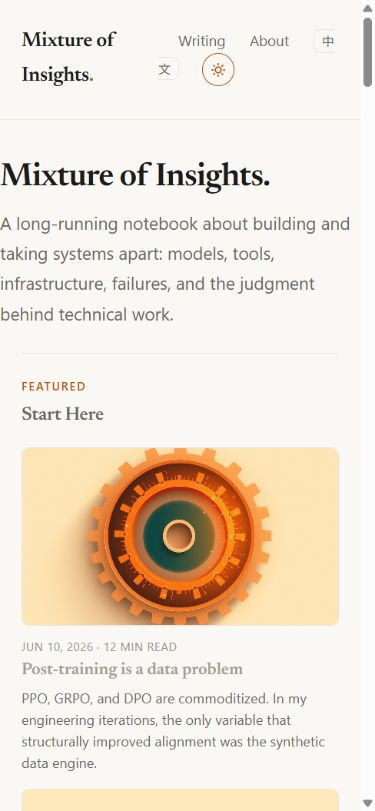
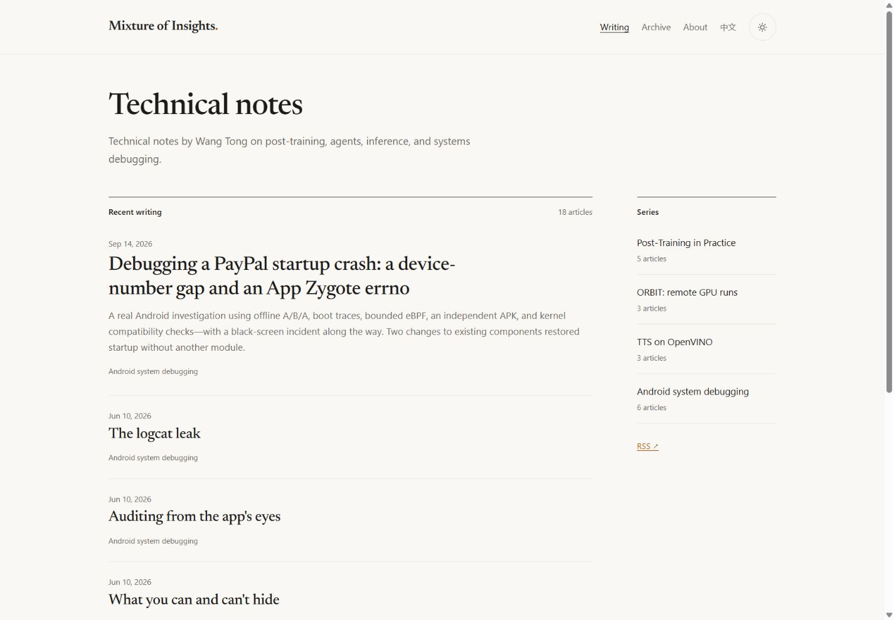
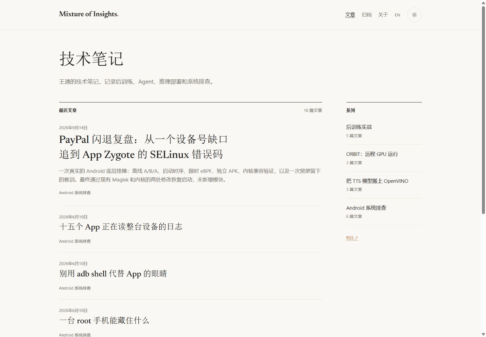
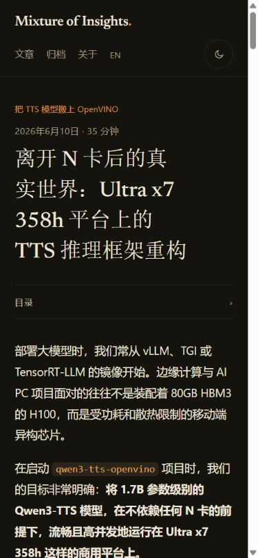

# 改版实现与验证 · 2026-09-14

实现已提交至 `codex/editorial-redesign-20260914`，沿用草稿 PR #1。没有合并、部署或更改生产工作流。本文记录实际测试，不把构建成功当作完整视觉或无障碍认证。

## 结果

- 首页显示当前语言最近 6 篇，原日期降序、slug 稳定次序；仅最新一篇显示摘要。右侧系列索引按实际内容计数（5 / 3 / 3 / 6），窄屏顺序接在文章后。当前每种语言各 18 篇。
- 新增双语归档、4 组双语系列页、中文 RSS。归档按 UTC 年份排列；前后篇继续遵循原系列顺序。系列和文章仅在对应译文存在时输出语言切换与 alternate。
- 首页与正文采用不同宽度。去掉列表装饰图、默认文章头图、正文重复摘要；保留全部 OG 文件与分享元数据。标签移到文末；长目录原生折叠；阅读进度按正文计算，排除评论区。
- 补上 skip link、可见焦点、当前导航状态、本地化主题按钮、44px 主题触摸目标、系统主题跟随和减少动态效果支持。修复移动端横向边距被旧样式覆盖的问题，以及 giscus iframe 加载时在 320px 撑宽页面的问题。
- 首页、系列、About 文案已精简；只局部编辑两个指定样本的中英文版本。其他正文未重写，事实疑问见 [EDITORIAL_AUDIT.md](EDITORIAL_AUDIT.md)。

## 可执行检查

基线为 `d3ac16b055198fafa8ce054ac11334093b3a30d2`，在独立基线 checkout 完成构建（40 个 HTML 页面）。改版后为 50 个 HTML 页面，新增 10 个索引页面，另新增中文 RSS 文件。

| 检查 | 实际结果 |
| --- | --- |
| Node 22 安装与构建 | GitHub Linux 检查任务实际运行 `npm ci`、`npm run check`、`npm run build`、`npm test`，全部成功；PR Checks 可查看当前提交结果 |
| 本地构建 | Node 22.23.2，Astro 5.18.2；50 页面，最终构建成功，无构建警告 |
| 类型检查 | 27 文件，0 errors / 0 warnings / 0 hints |
| 受保护内容 | 36 个原文章地址、标题、日期、series/order、reading/tags、代码块、公式、标题锚点来源、来源链接和图形内容保持一致；另 32 份正文哈希不变 |
| 静态回归 | 50 页、1,076 处站内引用；canonical/hreflang、双语归档、系列次序/前后篇、RSS 数量/次序、sitemap、giscus pathname 配置通过 |
| 资产与部署边界 | `public/og/` 没有改动；原部署工作流没有改动；新增 PR 检查只有 `contents: read`，不使用部署凭据 |

首个已通过的 [GitHub 检查记录](https://github.com/wangtong10086/mixtureofinsights/actions/runs/34846954221) 对应实现与测试提交 `e9e9e45`。其后的 CSS 排版精调及本文档提交继续由相同 PR 检查验证，最终状态以 PR 当前提交为准。

本地 Windows 的 npm/Astro 命令 shim 曾停滞，另一次尝试遇到缓存文件 EPERM/EBADF。安装使用现有 npm 11 CLI 加 Node 22 完成；本地验证采用规范化路径 `node node_modules/astro/astro.js build` 与 `check`，成功。Vite 缓存放入 checkout 自己的 `.astro/vite`，避免基线 checkout 共用依赖目录时争用缓存。Linux CI 的标准 npm 命令全部成功；没有为此替换 Astro 或修改系统默认 Node。

新增开发依赖只有 `@astrojs/check` 和 TypeScript，用于真实类型检查；没有新增浏览器运行时框架。

## 浏览器检查

浏览器：Codex 内嵌 Chromium；本地静态预览 `http://127.0.0.1:4321/`。也查看了生产首页的中英文、浅深色与手机基线。

四个宽度 320 / 390 / 768 / 1440 CSS px × 两种语言 × 两种主题 × 五类页面（首页、归档、后训练系列页、后训练样本、TTS 样本），共 **80 组**。逐组导航、检查文档宽度、h1 数量、主题、目录初始状态并保存首屏截图；全部无整页横向溢出、重复 h1 或错误的默认展开目录。最后调整窄屏导航间距与标题均衡换行后，另复测了 24 组受影响手机页面，全部通过。

80 张截图并非都已逐张进行视觉审读。实际视觉审读包括：桌面 EN/ZH 首页、390px ZH 首页、768px ZH 首页、768px EN 深色归档、1440px EN 系列、1440px ZH 深色后训练正文、390/320px ZH 深色 TTS、320px EN PayPal 表格、ZH About，以及手机无脚本正文。代表截图在本目录的 `redesign/` 中。

| 行为 | 证据与限制 |
| --- | --- |
| 手机导航与长标题 | 320px 导航不再将主题按钮挤到单独一行；390px 中文长标题经均衡换行避免末行单字。没有改变文章标题 |
| 目录与锚点 | ZH 后训练目录展开、第二个标题链接点击成功；目标位于视口上方约 24px，原 ID 保持一致 |
| 代码、ASCII 与公式 | 手机端代码/ASCII 在自己的框中滚动；深色 KaTeX 可见，无整页溢出。当前 Markdown 正文没有内嵌 SVG，不声称完成不存在的 SVG 图检查 |
| 表格 | 320px EN PayPal 表格实际可读，无整页溢出；表格容器保留局部滚动能力 |
| 语言切换 | 真实点击归档 ZH→EN、系列 EN→ZH，URL 和内容语言正确；全部文章与前后篇链接另由静态测试验证 |
| 主题 | 初始系统深色、运行中系统切到浅色、手动选择优先于系统、刷新保持选择，均实际检查。主题按钮名称随状态变化 |
| 键盘与减少动态效果 | Tab 首次聚焦可见 skip link，Enter 后焦点落在 main-content；模拟 reduced-motion 时 scroll-behavior=auto，transition-duration=0s |
| 禁用 JavaScript | 通过 CDP 禁止脚本后强制刷新，确认 en/zh 文章可读、HTML 没有脚本设置的 theme 属性、ZH 没有评论 iframe，原生目录仍能点击展开。未将这项检查表述为全部无脚本导航逐一测试 |
| 放大 | 720 CSS px、DPR 2 的重排检查通过；内嵌浏览器的原生 200% 菜单缩放未验证，模拟不等同于该项通过 |
| 阅读进度 | TOC 跳至靠后正文时进度更新；计算目标固定为 article-body，评论高度不参与 |
| giscus | iframe 正确创建，URL 包含原 pathname、中文 locale 和 dark_dimmed；主题变更后注入脚本配置同步。此会话内 iframe 评论内容为空，未确认其内部主题呈现、登录或发表流程；未发表测试评论。生产评论加载仍需复核 |

未做屏幕阅读器、Firefox/Safari、真实移动设备、性能跑分或全站逐句内容审查；未把这些列为通过。没有运行付费图片生成、部署或生产写入测试。

## 预览与复跑

```sh
npm ci
npm run check
npm run build
npm test
npm run preview -- --host 127.0.0.1 --port 4321
```

访问 `/`、`/zh/`、`/archive/`、`/zh/archive/`、`/series/post-training/` 和两篇样本。切换语言与主题，缩窄浏览器，展开目录。`scripts/fixtures/content-baseline.json` 保留原始身份与内容保护值；新增文章不必替换已有基线，正式技术修订需要单独审阅相应保护值的变化。

### 代表截图

改版前后英文首页：





中文首页和手机阅读：





